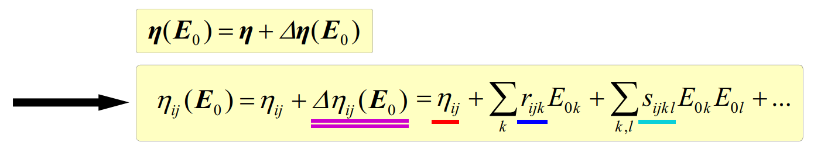
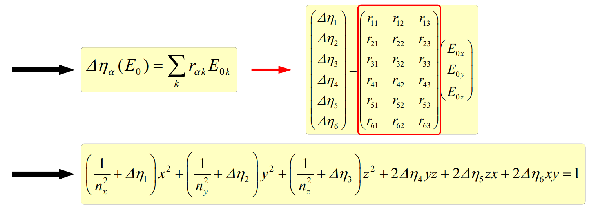

+++
date = '2025-11-29T17:02:54+08:00'
draft = false
title = '光电子学：调制'
tags = ["课程总结", "光学"]
author = 'RayChaux'
math = true
+++

## 一、电光调制
### 1.1 电光效应原理
如果在晶体中沿某一方向加一定电场E，则晶体的折射率n要发生相应的改变，因而晶体的双折射特性也要改变。
#### 1.1.1 理论推导
麦克斯韦物质方程组有电位移矢量$D=\varepsilon E$，$D$实际上反映了光波在介质中的偏振方向，经过推导，有
$$
\begin{bmatrix}
D_x \\
D_y \\
D_z
\end{bmatrix}=\varepsilon_0
\begin{bmatrix}
\varepsilon_x & 0 & 0 \\
0 &\varepsilon_y & 0 \\
0 & 0 & \varepsilon_z
\end{bmatrix}
\begin{bmatrix}
E_x \\
E_y \\
E_z
\end{bmatrix}
$$  
在外加电场的情况下，介电张量可以以描述为：
$\varepsilon(E_0)=\varepsilon+\Delta\varepsilon(E_0)$  
其中，$\varepsilon$为无电场时的介电张量，为对角矩阵，是一个对称张量，有$\varepsilon_{ij}=\varepsilon_{ji}$和$\Delta\varepsilon_{ij}=\Delta\varepsilon_{ji}$.

<!-- 折射率椭球的推导：
晶体中光波的电磁能密度可以写为：
$w_e=\frac{1}{2}E\cdot D=\frac{1}{2\varepsilon_0}(\frac{D^2_x}{\varepsilon_x}+\frac{D^2_y}{\varepsilon_y}+\frac{D^2_z}{\varepsilon_z})$   -->
令$\eta=[\eta_{ij}]=(\frac{\varepsilon}{\varepsilon_0})^{-1}=\varepsilon_r^{-1}$，即，$\eta_{ij}$为相对介电常数$\varepsilon_{ij}$的倒数，使折射率椭球方程更简洁，得到
$$\eta_{ij}\to\sum_{i,j}x_i\eta_{ij}x_j=1\to\boxed{\eta_{11}x^2+\eta_{22}y^2+\eta_{33}z^2+2\eta_{23}yz+2\eta_{31}zx+2\eta_{12}xy=1}$$
晶体折射率可用电场E的幂级数来表示，~~电光效应一般是根据相对不渗透张量元素的变化来定义的~~。  

其中，$\eta_{ij}=\eta_{ij}(0)$，为与电场无关项，$r_{ijk}$为与电场相关的一阶项（Pockels因子），$s_{ijkl}$为二阶项（Kerr因子）。  
Pockels因子在中心对称材料中不存在，Kerr因子在所有材料中都存在，证明如下：

根据$\varepsilon$的对称性质，有$\eta_{ij}=\eta_{ji}$和$\Delta\eta_{ij}=\Delta\eta_{ji}$，将$ij$根据下面的对应关系简化为单个参数$\alpha$，得到简化后的表达式。

在主坐标系中，

外加电场时，

得到新的折射率椭球方程为

对坐标进行旋转变换得到新的主轴，用$\hat{X},\hat{Y},\hat{Z}$表示旋转后的主轴坐标，旋转后的折射率椭球为：$\frac{X^2}{{n_X}^2}+\frac{Y^2}{{n_Y}^2}+\frac{Z^2}{{n_Z}^2}=1$，其中，$n_X,n_Y,n_Z$为旋转后的主折射率。  
旋转变换得到新坐标系的过程实际上是将$\eta_{ij}$矩阵对角化的过程，这个过程可以用求解特征值来解决。  
$$\begin{gathered}\eta_{ij}=\begin{bmatrix}\eta_{11}&\eta_{12}&\eta_{13}\\\eta_{21}&\eta_{22}&\eta_{23}\\\eta_{31}&\eta_{32}&\eta_{33}\end{bmatrix}=\begin{bmatrix}1/n_x^2+r_{1k}E_{0k}&r_{6k}E_{0k}&r_{5k}E_{0k}\\r_{6k}E_{0k}&1/n_y^2+r_{2k}E_{0k}&r_{4k}E_{0k}\\r_{5k}E_{0k}&r_{4k}E_{0k}&1/n_z^2+r_{3k}E_{0k}\end{bmatrix}\end{gathered}$$

有Pockels因子$r_{ijk}=r_{jkl}=r_{\alpha k}$，得到

说明Pockels因子只有18个独立的参数，实际中，由于晶体的对称性，矩阵中非零独立元素的数量会减少。  
#### 1.1.2 一些晶体的例子
<!-- 1. 立方晶体
   各向同性：$n_x=n_y=n_z=n_o,X=Y=Z$
   Pockels因子只有三个非零独立元素：
   
2. 四方晶体
   如KDP晶体，
3. 三方晶体
   Pockels因子有8个非零独立元素：
    -->
### 1.2 电光调制
#### 1.2.1 四方晶系——KDP晶体
对于KDP晶体，$n_x=n_y=n_o,n_z=n_e$  
$$\begin{pmatrix}0&0&0\\0&0&0\\0&0&0\\r_{41}&0&0\\0&r_{41}&0\\0&0&r_{63}\end{pmatrix}\longrightarrow\begin{aligned}&\begin{pmatrix}\Delta\eta_1\\\Delta\eta_2\\\Delta\eta_3\\\Delta\eta_4\\\Delta\eta_5\\\Delta\eta_6\end{pmatrix}=\begin{pmatrix}0&0&0\\0&0&0\\0&0&0\\r_{41}&0&0\\0&r_{41}&0\\0&0&r_{63}\end{pmatrix}\begin{pmatrix}E_{0x}\\E_{0y}\\E_{0z}\end{pmatrix}\end{aligned}$$

在实际使用中，调制电场只有一个方向不为0，即$E_{0x},E_{0y},E_{0z}$只有一个值不为0。在此情况下，输入光波有两种调制方式，纵向调制（光波沿着与调制场平行的方向传播）和横向调制（光波沿着与调制场垂直的方向传播）。  

当电场沿着光轴（z轴）方向施加时，$E_{0x}=E_{0y}=0$，折射率椭球变为  
$$\frac{x^{2}}{n_{o}^{2}}+\frac{y^{2}}{n_{o}^{2}}+\frac{z^{2}}{n_{e}^{2}}+2r_{63}E_{0z}xy=1$$

上式中，乘积项不包含z，说明变换后的$\hat{Z}$仍为原来的z轴，仅有$\hat{X},\hat{Y}$由原来的x,y旋转变换得到。  
定义$$\begin{array}{ll}x=X\cos\theta-Y\sin\theta&X=x\cos\theta+y\sin\theta\\y=X\sin\theta+Y\cos\theta&Y=-x\sin\theta+y\cos\theta\end{array}$$  
带入折射率椭球，有  

由$cos2\theta=0$，得到$\theta=45^\circ$，即xy平面上，新的$\hat{X},\hat{Y}$由原来的xy坐标轴旋转45°得到，带入$\theta $得到折射率椭球方程   
$$\left(\frac{1}{n_o^2}+r_{63}E_{0z}\right)X^2+\left(\frac{1}{n_o^2}-r_{63}E_{0z}\right)Y^2+\frac{Z^2}{n_e^2}=1$$
以及变换关系  
$$\begin{cases}&\hat{X}=\frac{1}{\sqrt{2}}\left(\hat{x}+\hat{y}\right)\\&\hat{Y}=\frac{1}{\sqrt{2}}\left(-\hat{x}+\hat{y}\right)\\&\hat{Z}=\hat{z}&\end{cases},\begin{cases}&\frac{1}{n_{X}^{2}}=\frac{1}{n_{o}^{2}}+r_{63}E_{0z}\\&\frac{1}{n_{Y}^{2}}=\frac{1}{n_{o}^{2}}-r_{63}E_{0z}\\&\frac{1}{n_{Z}^{2}}=\frac{1}{n_{e}^{2}}\end{cases}\rightarrow\begin{cases}&n_X=n_o\left(1+n_o^2r_{63}E_{0z}\right)^{-1/2}\\&n_Y=n_o\left(1-n_o^2r_{63}E_{0z}\right)^{-1/2}\\&n_{Z}=n_{e}\end{cases}$$
根据近似关系$r_{63}\approx10^{-11}m\cdot V^{-1}\quad\longrightarrow\quad n_o^2r_{63}E_{0z}<<1$,有  
$$\begin{cases}&n_X\approx n_o-\frac{1}{2}n_o^3r_{63}E_{0z}\\&n_Y\approx n_o+\frac{1}{2}n_o^3r_{63}E_{0z}\\&n_Z=n_e\end{cases}$$
KDP晶体沿z轴加电场时，由单轴晶体变成双轴晶体，折射率椭球的主轴绕z轴旋转了45°，称为感应主轴，此转角与外加电场的大小无关，其折射率变化与电场成正比，这是利用电光效应实现光调制、调Q、锁模等技术的物理基础。
**横向调制**

    
    

$$\Delta n=n_Y-n_X=\left(n_o+\frac{1}{2}n_o^3r_{63}E_{0z}\right)-\left(n_o-\frac{1}{2}n_o^3r_{63}E_{0z}\right)=n_o^3r_{63}E_{0z}=n_o^3r_{63}\frac{V}{l}$$
相移：$\varphi=\frac{2\pi}{\lambda}\Delta nl=\frac{2\pi}{\lambda}n_o^3r_{63}E_{0z}l=\frac{2\pi}{\lambda}n_o^3r_{63}V$，
令$\phi=\pi$，得到半波电压$V_\pi=\frac{\lambda}{2n_o^3r_{63}}$。
**横向调制**
$$\Delta n=n_Y-n_Z=\left(n_o+\frac{1}{2}n_o^3r_{63}E_{0z}\right)-n_e=\left(n_o-n_e\right)+\frac{1}{2}n_o^3r_{63}E_{0z}$$
相移：$\varphi=\frac{2\pi}{\lambda}\Delta nl=\frac{2\pi}{\lambda}(n_o-n_e)l+\frac{\pi}{\lambda}n_o^3r_{63}V\frac{l}{d}$，
令$\phi=\pi$，得到半波电压$V_\pi=\frac{\lambda}{n_o^3r_{63}}\cdot\frac{d}{l}$。