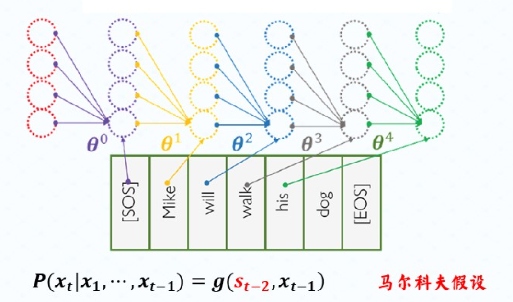
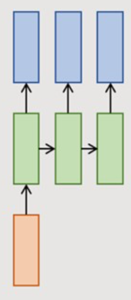
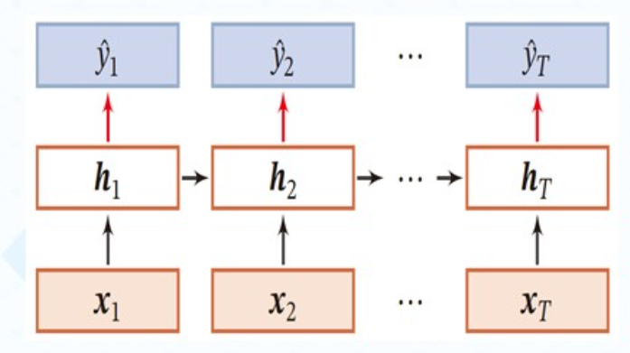
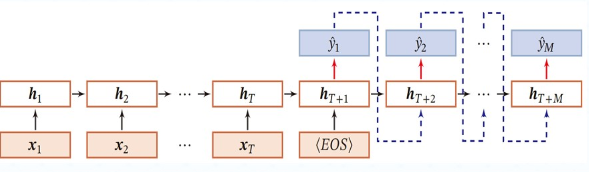
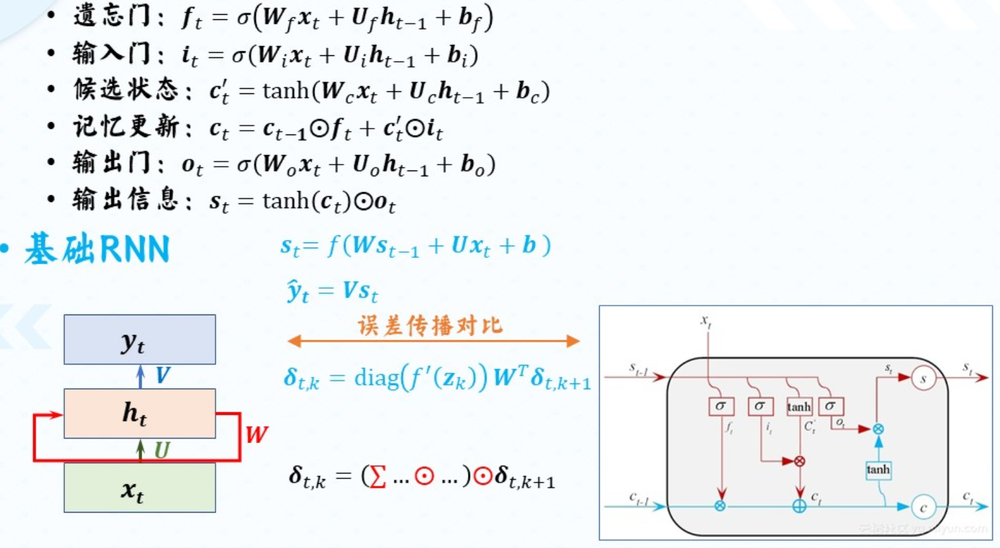

+++
date = '2025-12-05T17:02:54+08:00'
draft = false
title = '循环神经网络'
author = 'RayChaux'
tags = ["课程笔记", "神经网络"]
math = true
+++

## 一、基本模型
应用对象：语言、信号、视频、行为决策、运动轨迹
对于自然语言处理问题，通常情况下，输入的语句长度是不固定的，MLP无法处理可变长度的序列，要么固定网络长度，要么固定句子长度，前者需要多次训练，过于麻烦。  
**设计思想一：状态编码与短期记忆(局部输入)**  
序列中当前时刻之前的信息可以可以被编码为一个隐含的状态表示，也就是用一个标志位来储存已输入的信息。  
马尔科夫假设：一个随机过程的未来状态仅依赖于当前状态，而与过去的状态无关

**设计思想二：参数共享**  

时间平稳性假设：如果这个特征在某个时刻是有效的，那么他在下个时刻也是有效的

$h_t$为隐含状态，用于编码过去时间上的所有信息，并作为下一层输入。
**循环层的计算过程**
$$
\begin{cases}
y_t=Vh_t\\
h_t=f_w(h_{t-1},x_t)
\end{cases}
$$
其中，V为权值，依赖于具体的应用的激活函数，

### 1.2 RNN拓展
#### 1.2.1 双向循环神经网络
为了解决预测词后面词语的影响，提出双向循环神经网络  

拼接和求和，两种方法，拼接的兼容性更高  
#### 1.2.2 堆叠循环神经网络
区别于单层循环神经网络

### 1.3 RNN几种应用方式
#### 1.3.1 序列到类别：多对一
输入为序列，输出为类别，如情感识别、文档分类等聚类任务
① 终点模式

② 按时间加权采样模式

#### 1.3.2 单输入到序列：一对多
输入为单时刻的向量，输出为多个时刻的向量序列，如图像描述（图生文）

#### 1.3.3 同步的序列到序列模式：多对多
输入为序列，同步输出序列，如记号码、信息记录、故障监测、文本预测、视频动作识别等，相似的处理过程有卡尔曼滤波

#### 1.3.4 异步的序列到序列模式：多对多
输出与输入序列无严格对应关系，如机器翻译、编解码器，面临着信息瓶颈的挑战。

## 二、RNN的训练
### 2.1 随时间反向传播算法
即BPTT(Back Propagation Through Time)，

$s_t=$

### 2.2 实时循环学习算法

## 三、RNN的问题与改进
### 3.1 简单RNN的问题

### 3.2 长短期记忆网络-LSTM
引入门控机制，控制信息积累，有效解决梯度消失或爆炸问题

### 3.3 门控循环单元网络-GRU

