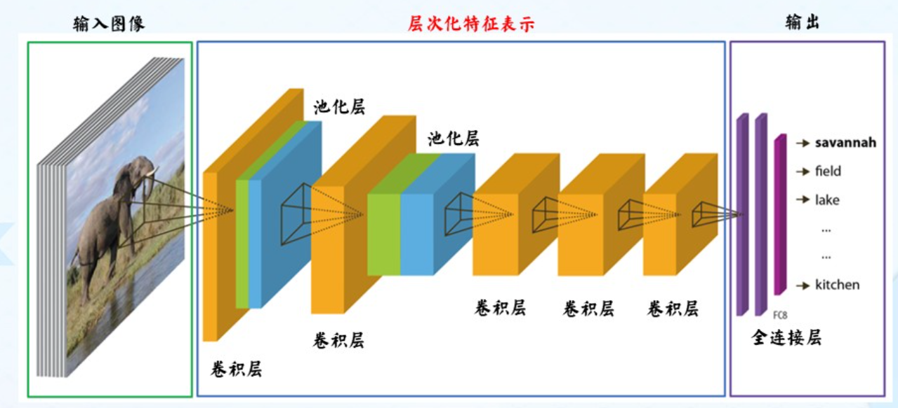

+++
date = '2025-11-29T17:02:54+08:00'
draft = false
title = '深层神经网络'
author = 'RayChaux'
tags = ["课程笔记", "神经网络"]
+++

## 1. 卷积神经网络
### 1.1 网络模型
&emsp;&emsp;典型的卷积神经网络模型如下图所示，

**Flatten**：将矩阵排列的数据重新整理为一维向量；  
**全连接网络**：每个输入参数（图片像素）都与神经元相连；  
- 缺点：局部信息丢失，不变性难保持  

**局部连接**：下一层神经元只与上一层特定神经元连接，上一层神经元只存在局部连接特征。**（连接数与输入层维数无关）**  
  
**参数共享**：同一特征在不同位置经过神经网络有相同相应。    
  
***局部连接+参数共享 = 卷积 - 翻转***  
**stride**：卷积核滑动的像素距离，xy方向  
**padding**：图像四周补0，使得卷积输出图像大小与原图相同(等宽卷积1)  
卷积核：$k\times k \times d$  
$h_{new} = [(h-k+2\times padding)/stride]+1$  
$w_{new} = [(w-k+2\times padding)/stride]+1$
常用卷积变体：空洞卷积、三维卷积&1x1卷积。
#### 1.1.1 卷积层
作用：提取特征，不同卷积核的目标特征不同
卷积层参数量计算：
MxN的输入图像，若为等宽卷积
$k\times k$卷积核：
参数量：$(k\times k+1)\times M\times N$
多个卷积层总参数量为各层参数量相加
#### 1.1.2 池化层
**定义：** 在卷积层后，降低卷积层输出特征维度的非参数化操作，包括**采样分块**和**池化策略**。  

#### 1.1.3 全连接层

### 1.2 卷积神经网络的训练

**可能提高卷积网络训练性能的方法：**
使用随机梯度下降算法
使用带动量的梯度下降算法
使用数据增强方法
使用学习率衰减算法
其他方法

### 1.3 卷积神经网络的发展
ImageNet
几种重要的网络架构
#### 1.3.1 AlexNet：  
**网络特点：** 首次使用了ReLU激活函数、使用了数据增强的训练技巧、使用了Dropout、使用了局部响应归一化、使用了带动量的随机梯度下降、使用了多个GPU计算。  

**(1) ReLU激活函数：**  

优秀的梯度特性：一半梯度为1，一半梯度为0，缓解梯度消失问题  
**(2) LRN**(Local Response Normalization, 局部响应归一化)  

提高泛化能力，不同于最大值池化，是在不同通道间取最大值
#### 1.3.2 VGGNet
**网络特点：** 使用了更小的卷积核、使用了更深的网络、使用了分阶段的训练、提出了特征的共用思想。  
网络的缺点：在网络的最后几层有太多的网络参数。  

#### 1.3.3 InceptionNet
**(1) 典型代表：GoogLeNet**
由9个Inceptionv1模块和5个汇聚层以及其他一些卷积层和全连接层构成，总共为22层网络。  
为了解决梯度消失问题，GoogLeNet在网络中间层引入两个辅助分类器来加强监督信息。  

**(2) InceptionV3网络**
改进亮点：多层小卷积核替换大卷积核；批量归一化；标签平滑  
- 多层小卷积
    具体做法：  
    1、使用两层3× 3 的卷积来替换V1 中的5 ×5 的卷积；  
    2、使用连续的KX1和1XK来替换K×K的卷积。  
    多层小卷积的优点：  
    保持感受野不变的同时减少了计算量和参数量
    缺点：
    等价的可用滤波器（卷积核）变少，需要满足可分解的特点
    即假设空间变小，模型能力相对变弱
- 批量归一化

- 标签平滑
在传统的分类任务中，标签通常采用one-hot编码形式，这意味着目标类别的概率为1，其他类别的概率为0。标签平滑通过将目标类别的概率降低到小于1，同时将其他类别的概率提高到大于0，从而生成一个更平滑的标签分布。这种方法可以有效地减少模型在训练过程中的过拟合现象。
