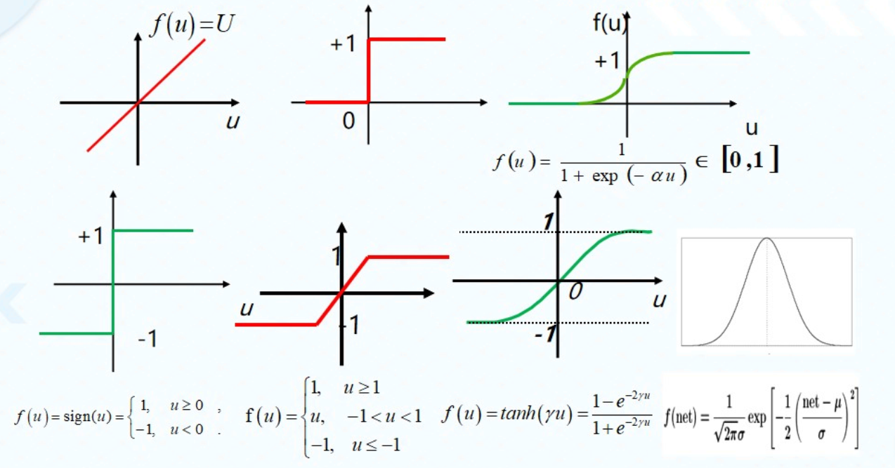
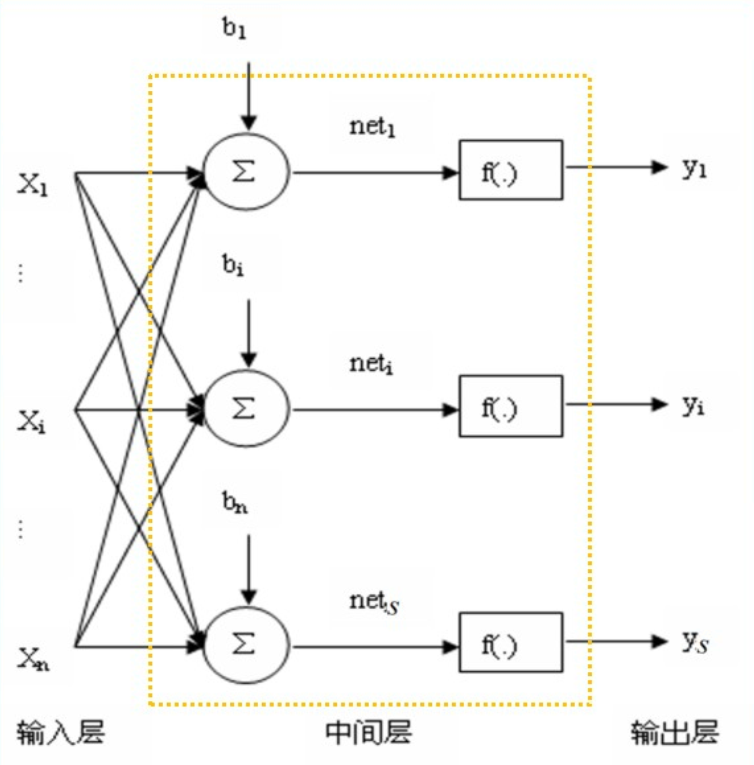

+++
date = '2025-11-29T17:02:54+08:00'
draft = false
title = '人工神经网络(ANN)'
tags = ["课程笔记", "神经网络"]
series = ["神经网络"]
series_order = 1
author = 'RayChaux'
math = true
+++

## 一、机器学习基本概念与定理
### 1.1 基本概念
### 1.2 常用定理
### 1.3 数学基础
### 1.4 神经网络发展历史
第一次浪潮：
第二个迅猛发展：算法突破与架构创新  
第三次浪潮：深度学习崛起与架构革命  
第四次浪潮：大模型时代与多模态融合  
## 二、人工神经网络（ANN）
### 2.1 定义：
- 神经网络是由具有适应性的简单单元组成的广泛并行互联的网络，它的
组织能够模拟生物神经系统对真实世界物体所作出的反应。
- 神经网络是由简单处理单元构成的大规模并行分布式处理器，天然地具
有存储经验知识和使之可用的特性。  

### 2.2 生物神经元模型：

  

    <strong>突触间隙发生量子化学或电化学反应，促成化学信号与电信号的转换</strong>：电脉冲一神经递质（神经元和效应细胞之间传递信息的化学物质）→膜电位变动 
    <strong>兴奋型与抑制型</strong>(excitatory/inhibitory)：依膜电位阈值而定 
    <strong>可塑性</strong>：突触传递特性可变，强弱正负皆可调---学习记忆之基石 
    <strong>时空整合性</strong> 
    时间整合：不同时段的神经冲动于同一突触汇聚 
    空间整合：同时段不同突触的膜电位协同整合
  

  

  
生物神经元是一个多输入、单输出的信息处理单元，单输出可以分枝为多个并行的相同输出，以便输入到其他神经元。

### 2.3 人工神经元
#### 2.3.1 人工神经元结构
根据生物神经元抽象出人工神经元模型，基本结构：加权求和+非线性激励，即  
累加器输出：**$net_t=\sum^N_{j=1}\omega_{ij}+b_i$**  
网络输出：**$y_i=f(net_t)$**  
其中，$w_{ij}$为输入的权值，$b_i$为偏置。  
以上就是一个简单的单层感知机，具体参考[单层感知机的介绍](https://zhuanlan.zhihu.com/p/74568310)。  
神经网络最核心的问题就是求网络的权值，方法是通过学习和训练。  
激活函数的选取$f(\cdot)$的选取模拟了神经元的整合能力，提供了网络的非线性建模能力，常用的有  

深度神经网络的采用**ReLu函数**作为激活函数，起到了防止梯度消失的作用。
#### 2.3.2 人工神经网络的数学描述

人工神经网络的结构可以用矩阵表示：  
$net=W\cdot x+b, Y=f(net)=f(Wx+b)$，其中
$$
W =
\begin{bmatrix}
w_{11} & w_{12} & \cdots & w_{1n} \\
w_{21} & w_{22} & \cdots & w_{2n} \\
w_{s1} & w_{s2} & \cdots & w_{sn} 
\end{bmatrix}
,X=
\begin{bmatrix}
x_1 \\
x_2 \\
\vdots \\
x_s 
\end{bmatrix}
,b=
\begin{bmatrix}
b_1 \\
b_2 \\
\vdots \\
b_s 
\end{bmatrix}
,Net=
\begin{bmatrix}
net_1 \\
net_2 \\
\vdots \\
net_s 
\end{bmatrix}
,Y=
\begin{bmatrix}
y_1 \\
y_2 \\
\vdots \\
y_s 
\end{bmatrix}
$$
用矩阵形式层级图表示为

有了基本的人工神经元模型，可以构建出不同类型的人工神经网络，

## 三、基于自适应信号处理(ASP)的人工神经网络

定义输入矢量为：$X_k=[x_{0k},x_{1k},\cdots,x_{Nk}]^T$
权矢量为：$W_k=[W_{0k},W_{1k},\cdots,W_{Nk}]^T$
ASP神经元输出为：$S_k=W^TX_k$
ASP神经元总输出为：$y_k=f(S_k)$
线性误差为：$\epsilon_k=d_k-S_k=d_k-W^T\cdot X_k$
均方误差为：$MSE=E{(d_k-W^T\cdot X_k)^2}$
采用最小均方算法（梯度下降的优化算法），即LMS算法，改变权使得MSE达到极小。  
LMS算法：即最小均方算法(Least Mean Square)，是一种最陡算法的改进算法，该算法不需要已知输入信号和期望信号的统计特征，“当前时刻”的权系数是通过“上—时刻”权系统+—个负均方误差梯度的比例项求得。  
新的权值$w_{k+1}=w_k+\mu\cdot(-\nabla_k)$
$\mu$是迭代步长/学习率，$\nabla_k=\frac{\partial MSE}{\partial w_k}$是梯度，带入MSE，得$\nabla_k=\frac{\partial}{\partial w_k}E(\epsilon^2_k)$
工程上常用瞬时功率${\epsilon_k}^2$代替平均功率$E({\epsilon_k}^2)$，即  
$MSE=E({\epsilon_k}^2)\approx{\epsilon_k}^2$

## 