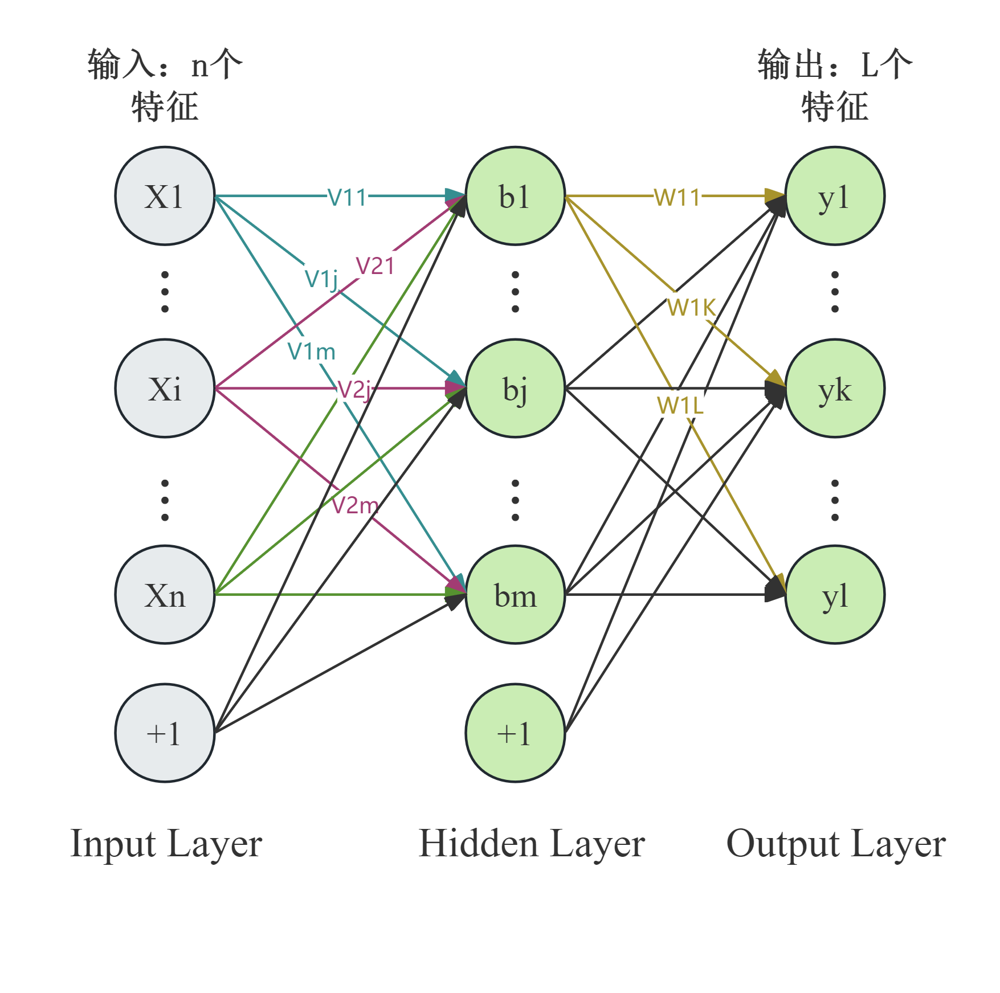
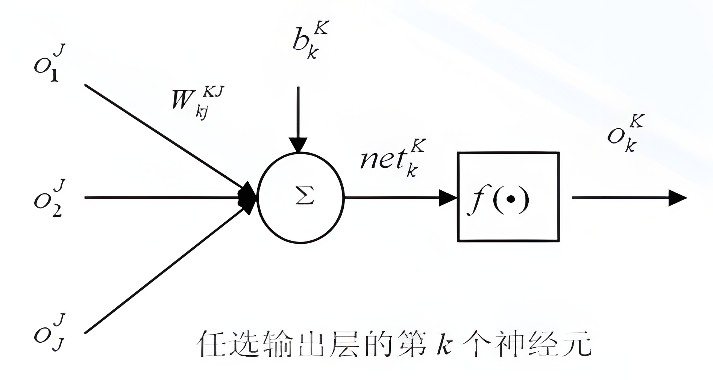
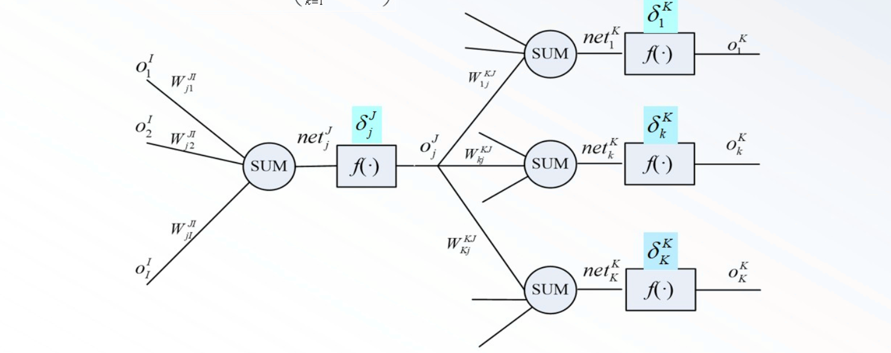

+++
title = '浅层神经网络'
date = '2025-12-23T15:28:07+08:00'
author = 'RayChaux'
draft = false
tags = ["课程笔记","神经网络"]
series = ["神经网络"]
series_order = 2
math = true
+++

## 一、多层感知机与反向传播算法
### 1.1 单层感知机的问题
单层感知机（Rosenblatt）可以实现简单的分类问题，但不能解决异或问题。（异或逻辑运算从几何意义上讲是线性不可分的）  
MLP引入了隐藏层，和非线性激活函数，被证明具有通用逼近能力。MLP的基本结构如下图所示，其中每一个小球就代表一个神经元结构。  

    
    

图片来源：[MLP的理解（CSDN）](https://blog.csdn.net/m0_73798143/article/details/136636647)
### 1.2 基本BP算法
#### 1.2.1 权值确定方法
在某种最优准则下，通过学习确定网络的权值$W_{kj}^{KJ}$和$W_{ji}^{JI}$。  
有网络输出为：$o_k^K=f(net_k^K)$；
累加器输出为：$net_k^K=\sum\limits_{j=1}^{J}W_{kj}^{KJ}\cdot+o_j^J+b_k^K$  
定义损失函数：$E=\frac{1}{2} \sum\limits_{k=1}^K\left(d_k-o_k^K\right)^2$  
其中，$d_k$为输出层第k个神经元的期望输出，$o_k^K$为该神经元的实际输出。  

    

后一个神经元与前一个神经元权值的关系如下，难点在于求出其中的微分项。  
$$\begin{cases}
W_{k j}^{K J}(n+1)=W_{k j}^{K J}(n)-\eta_k\left(\frac{\partial E}{\partial W_{k j}^{K J}}\right) \\
W_{j i}^{J I}(n+1)=W_{j i}^{J I}(n)-\eta_j\left(\frac{\partial E}{\partial W_{j i}^{J I}}\right)
\end{cases}$$
根据以上式子，由链式求导法则可得：  
$$\begin{cases}
-\frac{\partial E}{\partial W_{k j}^{K J}}=\left(d_k-O_k^K\right) f^{\prime}\left(n e t_k^K\right) \cdot O_j^J\\
-\frac{\partial E}{\partial W_{j i}^{J I}}=\sum_{k=1}^K\left(d_k-O_k^K\right) f^{\prime}\left(n e t_k^K\right) W_{k j}^{K J} f^{\prime}\left(n e t_j^J\right) O_i^I
\end{cases}$$  
两式对照可得，**本层误差信号 = 下一层误差信号累加和 * 本层激励函数的导数**。  
定义输出层第k个神经元的误差信号：$\delta_k=-\frac{\partial E}{\partial n e t_k^K}=\left(d_k-O_k^K\right)f^{\prime}\left(n e t_k^K\right)$  
**（误差信号的形式由激活函数决定）**  
隐含层第j个神经元的误差信号为：$\delta_j=-\frac{\partial E}{\partial n e t_j^J}$  
将$\delta_k$带入$-\frac{\partial E}{\partial W_{k j}^{K J}}$，再带入$W_{k j}^{K J}(n+1)$，得到  
$$\begin{aligned} & W_{k j}^{K J}(n+1)=W_{k j}^{K J}(n)+\eta_k \cdot\delta_k\cdot O_j^J \\ & k=1,2 \cdots K ; j=1,2 \cdots J\end{aligned}$$  
有  
$$\begin{aligned}&\delta_{k}=-\frac{\partial E}{\partial net_{k}^{K}};{\frac{\partial net_{k}^{K}}{\partial O_{j}^{J}}=W_{kj}^{KJ}}\\&\frac{\partial O_{j}^{J}}{\partial net_{j}^{J}}=f^{^{\prime}}(net_{j}^{J});{\frac{\partial net_{j}^{J}}{\partial W_{ji}^{JI}}=O_{i}^{I}}\end{aligned}$$
对于隐含层：  
$$\begin{aligned}\delta_{j}&=-\frac{\partial E}{\partial net_{j}^{J}}=-\sum_{k=1}^{K}\left(\frac{\partial E}{\partial net_{k}^{K}}\right)\frac{\partial net_{k}^{K}}{\partial O_{i}^{J}}\frac{\partial O_{j}}{\partial net_{j}^{J}}\\&=f^{^{\prime}}(net_{j}^{J})\left(\sum_{k=1}^{K}\delta_{k}W_{kj}^{KJ}\right)\end{aligned}$$
在MLP网络中，误差是反向传播的，于是  
$$\begin{aligned}-\frac{\partial E}{\partial W_{ji}^{JI}}=&\left(-\sum_{k=1}^{K}\frac{\partial E}{\partial net_{k}^{K}}\bullet\frac{\partial net_{k}^{K}}{\partial O_{j}^{J}}\bullet\frac{\partial O_{j}^{J}}{\partial net_{j}^{J}}\right)\bullet\frac{\partial net_{j}^{J}}{\partial W_{ji}^{JI}}\\&=\delta_{j}\bullet O_{i}^{I}\end{aligned}$$
#### 1.2.2 核心内容总结

输出层学习算法：
$$\begin{aligned}&W_{kj}^{KJ}(n+1)=W_{kj}^{KJ}(n)+\eta_{k}\cdot\delta_{k}\cdot O_{j}^{J}\\&k=1,2,\cdots,K;j=1,2,\cdots,J\\&\delta_{k}=(d_{k}-O_{k}^{K})f^{\prime}\left(net_{k}^{K}\right)\end{aligned}$$
隐含层学习算法：
$$\begin{aligned}&W_{ji}^{JI}(n+1)=W_{ji}^{JI}(n)+\eta_{j}\cdot\delta_j\cdot O_{i}^{I}\\&i=1,2,\cdots,I;j=1,2,\cdots,J\\&\delta_{j}=f^{^{\prime}}(net_{j}^{J})\left(\sum_{k=1}^{K}\delta_{k}W_{kj}^{KJ}\right)\end{aligned}$$

#### 1.2.3 BP算法的特点
- **工作信号正向传播**。在信号的向后传递过程中网络的权值是固定不变的，每一层神经元的状态只影响下一层神经元的状态。如果在输出层不能得到期望的输出，则转入误差信号反向传输。
- **误差从后往前传播**。误差信号由输出层开始逐层向前传播，在反向传播
的过程中，网络的权值由误差反馈进行调节，通过权值的不断修正使网
络的实际输出更接近期望输出。
- **并行的**：硬件实现速度快
- 层内无神经元连接

## 二、径向基函数RBF网络

## 三、概率PRBF神经网络

## 四、动态神经网络
