+++
date = '2025-11-29T17:02:54+08:00'
draft = false
title = '卷积神经网络'
author = 'RayChaux'
tags = ["课程笔记", "神经网络"]
series = ["神经网络"]
series_order = 3
math = true
+++

## 0. 由浅入深
**通用近似定理：**
 
没有卷积层的情况下，采用**全连接网络**：每个输入参数（图片像素）都与神经元相连。  
**Flatten**：将矩阵排列的数据重新整理为一维向量
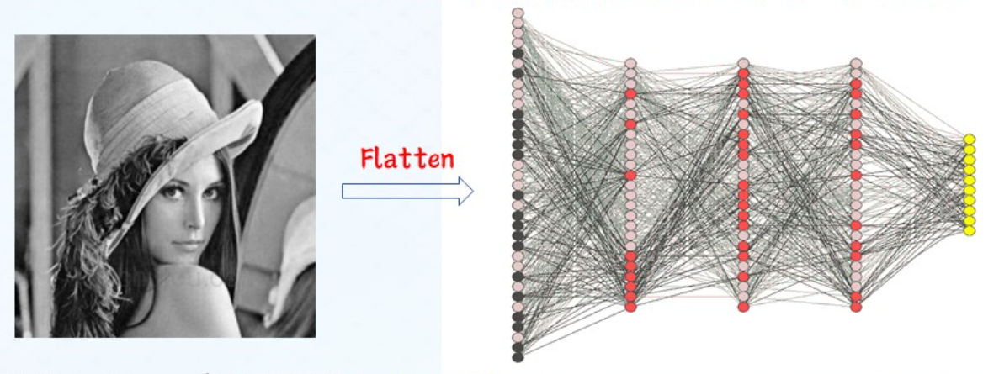
**全连接网络的缺点：**
- 参数量、运算量巨大；   
- 局部空间信息丢失；  
图像中的像素点间存在局部空间关联关系，全连接网络却将所有的像素同等对待
- 不变性难保持
图像对象中存在多种不变性因素，用于分类的重要特征在图像中的绝对位置并不重要  

实际中，图像的特征仅存在一部分区域，且出现的位置并不重要，由此引入局部连接和参数共享的思想。
**局部连接**：下一层神经元只与上一层特定神经元连接，上一层神经元只存在局部连接特征。**（连接数与输入层维数无关）**  
  
**参数共享**：同一特征在不同位置经过神经网络有相同相应。    
  

***局部连接+参数共享 = 卷积 - 翻转***，取图像块对应卷积，滑窗对应承参数共享。  
## 1. 网络模型
&emsp;&emsp;典型的卷积神经网络模型如下图所示，

  

### 1.1 卷积层
作用：提取特征，不同的卷积核提取不同的目标特征，一般采用多个卷积层提取不同的特征，卷积层减少了网络连接的数量
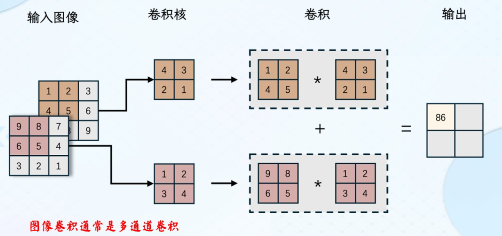
**stride**：卷积核滑动的像素距离，xy方向  
**padding**：图像四周补0，使得卷积输出图像大小与原图相同(等宽卷积1)  
卷积核：$k\times k \times d$  
$h_{new} = [(h-k+2\times padding)/stride]+1$  
$w_{new} = [(w-k+2\times padding)/stride]+1$
常用卷积变体：空洞卷积、三维卷积&1x1卷积。  
### 1.2 池化层
**定义：** 在卷积层后，降低卷积层输出特征维度的非参数化操作，包括**采样分块**和**池化策略**，主要有最大值池化和平均值池化两种池化策略。  
池化层减少了特征图中的神经元个数（即特征维数）
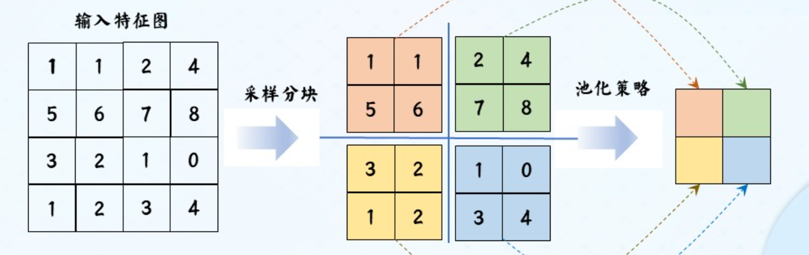 
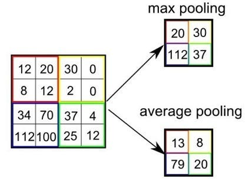
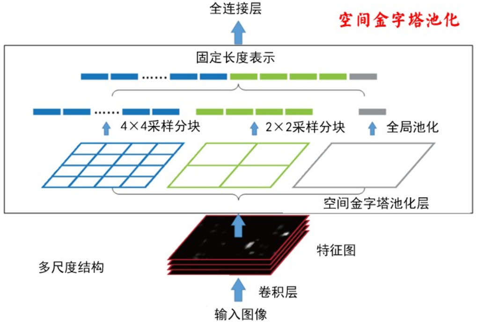
思考：卷积层的stride是否能取代池化层？
不能，stride增大虽然降低了维数，但会丢失图像的信息。
### 1.3 全连接层
&emsp;&emsp;卷积、池化、自注意力等操作虽然能提取局部或稀疏特征，但它们的输出仍然保持“空间维度”或“通道维度”上的独立性。最终任务（ImageNet 1000 类、CTR 预估、机器翻译选词）往往要基于“整幅图/整句话/整个用户行为序列”做决策，需要把全部局部响应压成一个固定长度的全局表征。  
&emsp;&emsp;全连接层把每个输入元素与每个输出元素都连起来，天然就是“一锅端”的混合器，一步到位完成“全局视图”。
**实现方法：** 与传统的NN相同，采用Softmax函数，
$g(z)_t=\frac{e^{z_i}}{\sum_{j=1}^{k}e^z_j}, g(z)_i=[0,1]$

### 1.4 参数计算
$M\times N$的输入图像，若为等宽卷积，$k\times k$的卷积核：
**卷积层参数量：**$(k\times k+1)\times M\times N$，多个卷积层总参数量为各层参数量相加  
**全连接层参数：**$输入大小\times(神经元数量+1)$
公式中加的1为神经元的偏置(bias)
示例：

## 二、 卷积神经网络的训练
### 2.1 通用数学模型与求解方法

**参数更新的步骤：**
1. 输入训练数据，前向计算得到网络输出值
2. 基于输出值和标签值计算损失函数
3. 反向计算得到各层权重和偏置的梯度值
4. 通过$θ^{t+1}=θ^t-\eta \Delta L(θ)$更新参数
### 2.2 提高卷积网络训练性能的方法
使用随机梯度下降算法
使用带动量的梯度下降算法
使用数据增强方法
使用学习率衰减算法
其他方法

## 三、 卷积神经网络的发展
### 3.1 ImageNet:
ImageNet是一个大型计算机视觉数据库，旨在支持视觉对象识别软件的研究，被广泛认为是推动深度学习在计算机视觉领域爆发的关键基础设施之一。
##### 一、基本定义
ImageNet由斯坦福大学等机构的研究者开发，模拟人类视觉识别系统，通过大规模标注图像帮助机器学习模型识别图像中的物体。它并非直接存储图像，而是提供带注释的图像URL数据库（实际图像归第三方所有）。
##### 二、核心特征
特征具体信息数据规模包含约1419万张图像URL，覆盖21841个类别（synsets）
标注类型:
-图像级标注：标记图像中是否存在某类对象（如“有老虎”）
-对象级标注：提供对象的边界框（超过100万张图像有此标注）支持细粒度分类（如120种狗的品种）获取方式注释数据库免费开放，供研究者使用几种重要的网络架构。
### 3.2 AlexNet：  
**网络特点：** 首次使用了ReLU激活函数、使用了数据增强的训练技巧、使用了Dropout、使用了局部响应归一化、使用了带动量的随机梯度下降、使用了多个GPU计算。  

**(1) ReLU激活函数：**  
$$
ReLU(x)=
\begin{cases}
x&x\geqslant 0\\
0&x<0
\end{cases}
= max(0,x)
$$  

**非线性：** ReLU是一个非线性函数，能够帮助神经网络模型学习非线性关系，提高模型的性能。  
**防止梯度消失：** ReLU的导数在输入大于0时是常数1，不会随着输入值的变化而趋近于0，有效避免梯度消失问题。  
**计算速度快：** ReLU的计算速度非常快，适合用于深层神经网络，可以有效减少计算时间和成本。  
**(2) LRN**(Local Response Normalization, 局部响应归一化)  
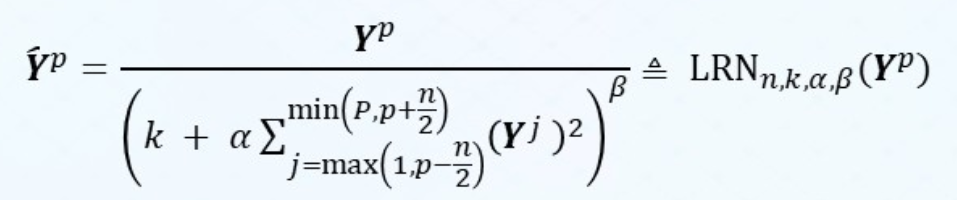
提高泛化能力，不同于最大值池化，是在不同通道间取最大值
### 3.3 VGGNet

  

    <strong>网络特点：</strong>使用了更小的卷积核、使用了更深的网络、使用了分阶段的训练、提出了特征的共用思想。 
    <strong>网络的缺点：</strong>在网络的最后几层有太多的网络参数。 
    <strong>VGG的分阶段训练</strong>：是训练深层VGG模型（如VGG16、VGG19）时采用的迁移式初始化策略，通过先训练浅
    层VGG模型，再用其权重初始化深层模型的对应层，
    解决深层网络直接训练的收敛困难问题，是VGG模型
    实现高效训练的核心技巧之一。 
    <strong>VGG的特征共用思想</strong>：是指在模型设计与任务应用中，通过复用已提取的特征资源来高效构建复杂语义表示或支持多
    任务学习的核心策略，主要体现在模型内部的特征层级复用和跨任务的特征提取层共用两个层面。
  

  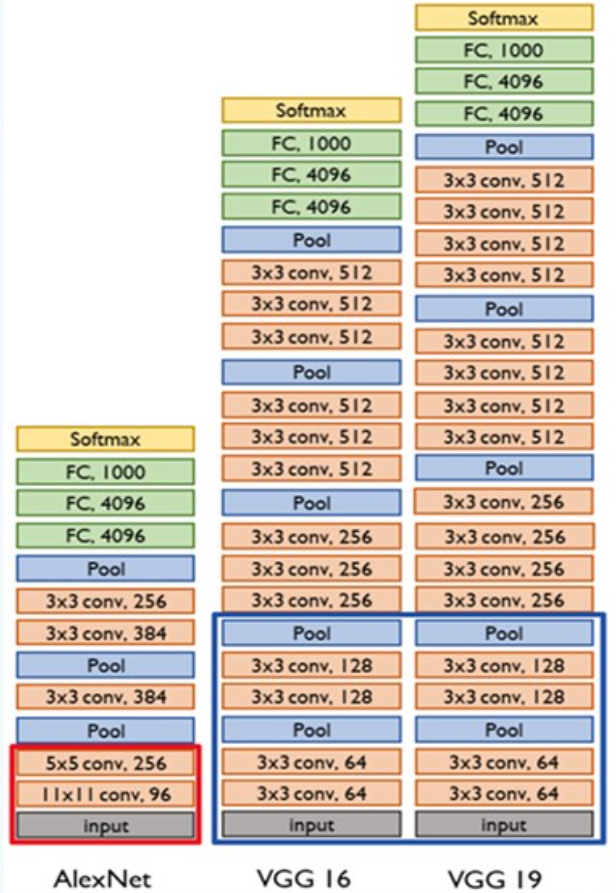

  

### 3.4 InceptionNet
#### 3.4.1 典型代表：GoogLeNet**
由9个Inceptionv1模块和5个汇聚层以及其他一些卷积层和全连接层构成，总共为22层网络。  
为了解决梯度消失问题，GoogLeNet在网络中间层引入两个辅助分类器来加强监督信息。  
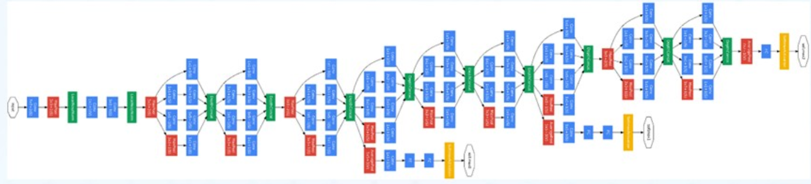
#### 3.4.2 InceptionV3网络
改进亮点：多层小卷积核替换大卷积核；批量归一化；标签平滑  
- 多层小卷积
    具体做法：  
    1、使用两层3× 3 的卷积来替换V1 中的5 ×5 的卷积；  
    2、使用连续的KX1和1XK来替换K×K的卷积。  
    优点：  
    保持感受野不变的同时减少了计算量和参数量
    缺点：
    等价的可用滤波器（卷积核）变少，需要满足可分解的特点
    即假设空间变小，模型能力相对变弱
- 批量归一化

- 标签平滑
在传统的分类任务中，标签通常采用one-hot编码形式，这意味着目标类别的概率为1，其他类别的概率为0。标签平滑通过将目标类别的概率降低到小于1，同时将其他类别的概率提高到大于0，从而生成一个更平滑的标签分布。这种方法可以有效地减少模型在训练过程中的过拟合现象。
### 3.5 ResNet
给非线性的卷积层添加残差连接
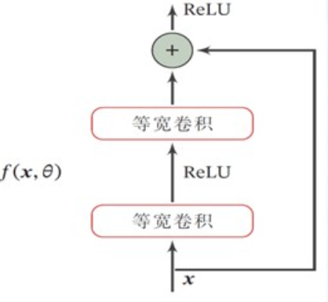

网络特点：
- 通过并行pathways增加了网络宽度；
- 更多的Highways，以重用底层特征。

## 四、 CNN轻量化
### 4.1 剪枝Pruning
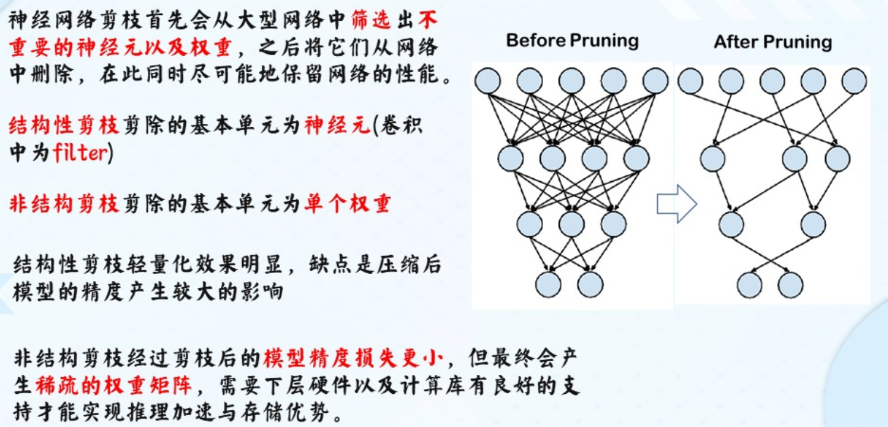
剪枝还能起到正则化的作用，增强抗过拟合的能力。
**剪枝的方法**
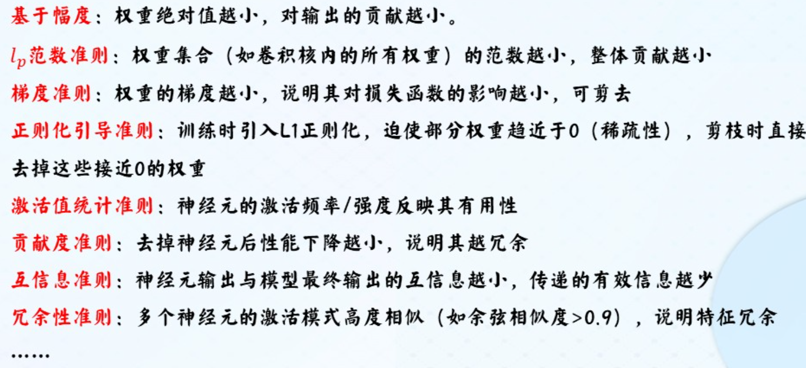
### 4.2 量化编码
：将模型权重的比特位数降低

### 4.3 轻量化设计
SqueezeNet

MobileNet
ShuffleNet
## 五、 CNN总结
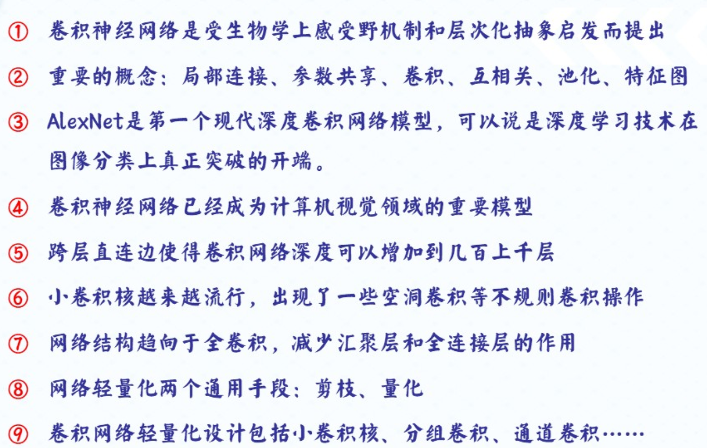
### 5.1 课后作业
图像修复问题

