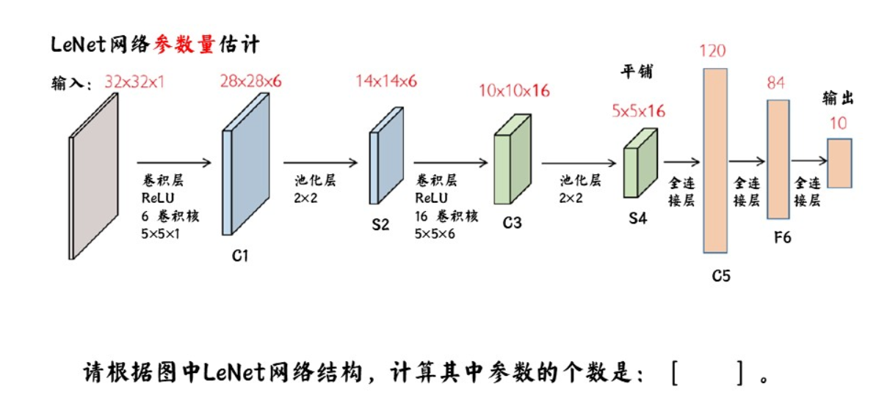
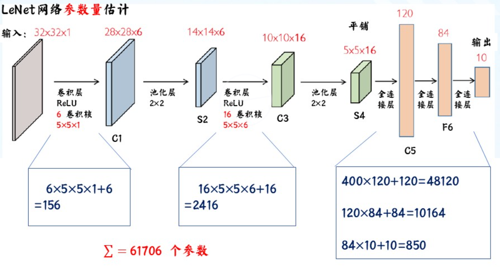
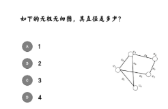

+++
title = '神经网络题目'
date = '2026-01-18T21:43:40+08:00'
author = 'RayChaux'
draft = true
tags = [["神经网络","课程笔记"]]
series = ["神经网络"]
series_order = 7
math = true
+++

## 知识点
1. AI/ML/DL/神经网络的层级关系；
2. 机器学习三要素、过拟合/欠拟合及解决方案；
3. 梯度下降三种变体的对比；
4. 分类任务性能度量（混淆矩阵、P-R、ROC、AUC）；
5. 偏差-方差分解的含义；
6. 神经网络基本结构、激活函数的作用；
7. MLP与BP算法的原理；
8. LSTM解决RNN的什么问题（梯度消失）及核心机制（门控+细胞状态）；
9. CNN的核心特性（局部感受野、权值共享、池化）；
10. 常用定理（奥卡姆剃刀、NFL）的应用场景。
11. 为什么要用位置Encoding?
12. 为什么要用掩码？
13. 为什么要用逐位置FFN？

## 课堂问题
1. 单层感知机是否能解决异或问题  
   不能
2. 极化项是否会使得隐含层输出趋于稳定，加速收敛？
   会
3. E步中的求期望是对什么数据进行的？
   缺失数据
4. 关于卷积和卷积层的论述正确的是：
   A. 只需要局部连接就可以使参数个数与输入及隐含层神经元个数无关。
   B. 卷积神经网络中局部连接和参数共享的思想通过卷积集中体现出来。
   C. 通过Stride操作可以实现等宽卷积。
   答案：B
5. 判断题：具有多个通道的二维卷积完全等价于三维卷积。
   错误
6. 计算：
   答案：
7. 卷积网络参数更新的步骤包括哪些?
   A. 输入训练数据，前向计算得到网络输出值
   B.基于输出值和标签值计算损失函数
   C.反向计算得到各层权重和偏置的梯度值
   D.通过$\theta^{t+1}=\theta^t-\eta\nabla L(\theta)$更新参数
   答案：ABCD
8. 请选出可能提高卷积网络训练性能的选项
   A.使用随机梯度下降算法
   B.使用带动量的梯度下降算法
   C.使用数据增强方法
   D.使用学习率衰减算法
   答案：ABCD
9. 下面有助于卷积网络轻量化的技巧包括
   A.空间可分离卷积
   B.深度可分离卷积
   C.更小的卷积核
   D.更多的全连接层
   答案：ABCD
10. 下面关于循环神经网络(RNN)的论述，错误的是：
   A.RNN采用了状态编码实现了时间上的短期记忆。
   B.RNN时间上的短期记忆使它只能捕捉到对上一时刻输入的依赖关系。
   C.RNN的参数共享体现在不同时刻上。
   D.理论上RNN能够建模长程依赖，但实际中依然困难。
   答案：B
11. 关于循环神经网络应用模式，以下说法错误的是：
   A. 文本分类是“多对一”应用模式的例子
   B. 基于图像的文本生成一般通过“一对多”应用模式实现
   C. 某些“多对多”应用模式可能导致信息瓶颈
   D. 机器翻译通常采用同步的“多对多”模式
   解析提示： 正确答案为 D。机器翻译通常采用“异步”的多对多模式（即 Seq2Seq 架构，先编码再解码），而非同步。
12. 以下关于 BPTT 描述，错误的是：
   A. BPTT 容易由长程依赖导致梯度消失或梯度爆炸
   B. 在任一时刻 RNN 都是一个 MLP，因此 RNN 和 MLP 的残差递推公式相同
   C. RNN 发生梯度消失或爆炸与激活函数选取有关
   D. RNN 的反向传播同时沿时间方向和深度方向传播
   解析提示： 正确答案为 B。虽然 RNN 在展开后类似于深层 MLP，但由于其权重 $W$ 在各时间步是共享的，其残差递推和梯度计算公式与普通的 MLP 存在显著差异。
13. 下列关于循环神经网络说法错误的是：
   A. 循环神经网络存在多种应用模式，既可以一对多、多对一，还可以有同步和异步的多对多应用模式。
   B. 随时间反向传播算法运算时占用存储空间比实时循环学习算法更多。
   C. 实时循环学习算法随着网络的前向计算同时计算梯度，可以实现在线学习和无限长序列学习。
   D. 实时循环学习算法运用的不再是误差反向传播原理。
   解析提示： 正确答案为 D。实时循环学习算法 (RTRL) 虽然在计算方式上与 BPTT 不同（它是向前传播偏导数），但其本质依然是基于微积分链式法则来求取误差梯度。
14. 关于 LSTM 和 GRU 的描述，错误的是：
   A. LSTM 的重要贡献是增强了梯度的流动
   B. GRU 和 LSTM 中的门控都是以 logistic 函数作为激活函数的全连接网络层
   C. 门控机制是 LSTM 中最重要的部分
   D. GRU 和 LSTM 中的门控是通过一个 0 到 1 之间的标量实现的
   解析： 图片中显示的正确答案为 D。错误原因在于门控通常是通过 向量（与隐藏状态维度相同）进行按元素相乘来实现的，而非单一的标量。
15. **关于注意力说法错误的是：**
   A. 注意力机制的目的是为了关注更重要的信息
   B. 普通注意力机制先计算注意力分布，后根据注意力分布随机选择使用哪一个输入
   C. 注意力的核心思想是对输入信息的选择性关注
   D. LSTM 和 GRU 中都蕴含了注意力思想
   解析： 选项 B 是错误的。普通注意力（Soft Attention）是根据分布对输入进行 加权求和，而不是“随机选择”某一个输入（那是 Hard Attention 的范畴，且不常用）。
16. 下面关于 Transformers 网络组成说法错误的是：
   A. 尺度内积注意力是对注意力计算方式的一种改进
   B. 多头注意力是为了获取更加丰富的特征表征
   C. 位置编码在原始 Transformer 中是一个参数化的计算组件
   D. 逐位置前馈神经网络层主要实现信息的非线性抽象
   解析： 正确答案为 C。在原始 Transformer 论文中，位置编码（Positional Encoding）使用的是固定的正弦和余弦函数，并不是通过模型训练得到的“参数化”组件。
17. 关于 Transformers 网络的编-解码器架构说法正确的是：
   A. 编码器或解码器均只使用一个自注意力模块
   B. 编码器与解码器之间通过一个自注意力模块连接
   C. 解码器中的掩码是为了获取更加高效的推理速度
   D. 根据不同的任务需要可以只使用编码器或只使用解码器
   解析： 正确答案为 D。例如，BERT 只使用了 Transformer 的编码器，而 GPT 系列则主要使用了 Transformer 的解码器。
   纠错提示： 选项 C 错误，解码器中的掩码（Mask）是为了防止在训练时看到未来的信息。
18. 计算：
   答案：2
19. 下面关于图网络的说法，错误的是：
   A. 图表示学习中节点嵌入的目的是让图中相似的顶点有相似的特征表示
   B. DeepWalk（基于随机游走的节点嵌入方法）同时利用了图的拓扑结构和顶点特征
   C. 深度优先能够找到“远距离”具有相似拓扑结构的节点
   D. 图表示学习是一种无监督学习
   答案：B
20. 关于玻尔兹曼机描述错误的是：
   A. 已知确定权重，产生一组数据样本，是玻尔兹曼机的样本生成问题
   B. 已知多组变量观测，寻找最优权重，是玻尔兹曼机的参数学习问题
   C. 玻尔兹曼机的样本生成问题和参数学习问题困难的原因在于配分函数的计算量太大
   D. 玻尔兹曼机每次状态更新都会使得系统能量降低
   答案解析： 正确答案为 D。玻尔兹曼机采用的是随机演化（如 Gibbs 采样），在更新过程中为了跳出局部最优，能量有可能会暂时升高。
21. 关于受限玻尔兹曼机 (RBM) 说法正确的是：
   A. RBM 的隐变量内部存在连接
   B. RBM 的全条件概率可以不计算配分函数
   C. RBM 进行吉布斯采样时不可进行分组采样
   D. RBM 训练采用对比散度算法时需要采样至网络达到热平衡状态
   答案解析： 正确答案为 B。由于 RBM 层内无连接，其条件概率具有因子分解特性，计算时不需要归一化常数（配分函数）。选项 D 错误是因为对比散度 (CD) 的核心就是通过少量采样步数（如 CD-1）来近似，不需要等到热平衡。
22. 关于 GAN 说法错误的是：
   A. GAN 借鉴了零和博弈的思想
   B. GAN 包含了一个生成器和一个判别器
   C. 生成器和判别器的网络类型只能是 MLP
   D. GAN 训练时需要平衡判别器和生成器的能力
   解析： 正确答案为 C。GAN 的生成器和判别器可以使用多种网络架构，如卷积神经网络 (DCGAN) 或循环神经网络，并不局限于多层感知机 (MLP)。
23. 下面说法错误的是：
   A. GAN 训练时，判别器太强会导致生成器难以获得正确的梯度
   B. 交叉熵目标函数的特性导致了 GAN 训练不稳定和模型坍塌
   C. WGAN 从理论上解决了 GAN 训练不稳定的问题
   D. WGAN 训练时需要保持生成器比判别器强
   解析： 正确答案为 D。在 WGAN 中，为了获得可靠的 Wasserstein 距离估计，通常需要将判别器（在 WGAN 中称为评论家 Critic）训练得足够好，而不是保持生成器比判别器强。
24. 下面说法正确的是：
   A. PCA 是一种随机性的数据降维方法
   B. 自编码器网络将数据编码为一个分布
   C. PCA 的降维与数据恢复过程可以理解为编码器和解码器
   D. 自编码器网络是一种线性数据降维方法
   解析： 正确答案为 C。PCA 通过投影矩阵实现降维（编码）和重构（解码）。选项 D 错误，因为自编码器通过引入非线性激活函数，可以实现非线性降维。
25. 下面说法错误的是：
    A. 自编码器网络将输入 $x$ 编码为一个确定的点
    B. 变分自编码器将输入 $x$ 编码为一个概率分布
    C. 变分自编码器通过再参数化使得梯度可以传递到编码器网络的权重
    D. 条件自编码器就是训练多个 VAE 实现生成不同内容
    解析： 正确答案为 D。条件变分自编码器 (CVAE) 是通过在输入和潜在空间中引入额外的条件信息（如标签向量）来控制生成内容的，而不是通过训练多个独立的 VAE。